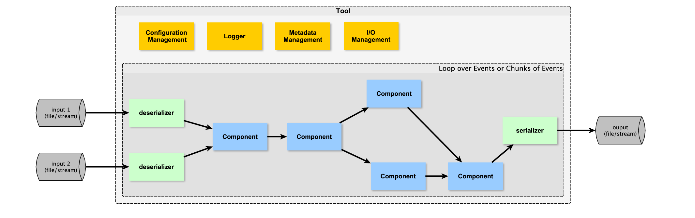

# ctapipe integration report 20171212

D. Neise & C. Alispach

## Preface

In the analysis call 20171128 SST1M decided to proceed integrating [digicampipe](https://github.com/calispac/digicampipe) into the nascent [ctapipe](https://github.com/cta-observatory/ctapipe).

   > We should get out as much as we can,
   and try to provide as much as we can to them.

## What can SST1M use from ctapipe?

According to ctapipe docu, *core is stable*

### ctapipe.core.Container

ctapipe.Containers are already used inside digicampipe e.g. [the R0CameraContainer](https://github.com/calispac/digicampipe/blob/master/digicampipe/io/containers.py#L77).

Still the question remained: were they used "the correct way"?

No issue opened here yet, [ctapipe#600](https://github.com/cta-observatory/ctapipe/issues/600) is related.

However, I want to comment regarding the "stable" predicate:
In [ctapipe#590](https://github.com/cta-observatory/ctapipe/issues/590) Karl Kosack said:

> Remember also that we are going to soon fully re-factor the Container class hierarchy, which means also refactoring the event source generators or FileReader classes

So the stability of this part of `ctapipe` is at the moment questionable.

### ctapipe.core.Component

`Component`s should do the work inside any `Tool` (see below).

Looking at this image we expected `Components` to have a very specific *Interface*, like:
 - `Component`s are callables with `Container` as `input`
 - `Component`s **add** their results to their `input`
 - `Component`s return their `input`

This can be called a "Processor Interface" and is well known in other IACT pipelines.
But this was **not the case**. On the contrary, our questions revealed there is
opposition against having an *Interface* defined for `Component`s.

So what are Components?
`ctapipe.core.Component` can **configure itself** from a config file and
it provides **logging**.

However, in
[ctapipe#591](https://github.com/cta-observatory/ctapipe/issues/591)
we agreed that `Processors` will come at some
point, and they will be *thin wrappers* around the actual work-functions which
can be just simple functions, taking any input (from an event or other
configuration) and returning any output (into the pipeline). The `Processor`
wraps that simple function so that it can finally be used inside a more
formalized pipeline.

### ctapipe.core.Tool

A `Tool` is a command line application similar to `digicampipe.pipeline_crab.py`

The Tool takes care of parsing command line parameters and merging them with
an optional config-file in order to **configure** all `Component` playing a role
in an application, like
 - the event_source (where is the input)
 - all worker functions
 - the sink (what kind of output, where to write)

Converting an application, which already exists in digicampipe into a `ctapipe.Tool`
is in my opinion the most straight forward step to "put digicampipe into ctapipe".

# Converting a Application to a Tool what's missing?

As an example, I looked at [`pipeline_crab.py`](https://github.com/calispac/digicampipe/blob/master/pipeline_crab.py).

## event_source

Up to line ~100 we see a lot of configurations. This will hopefully be nicely handled by `Components`.

The first "turning wheel" of the application is the [event_source](https://github.com/calispac/digicampipe/blob/master/pipeline_crab.py#L95). So we need to get a file reader into
ctapipe.

I've learned that "cocov" (Victor??) already opened a pull request long ago,
trying to get the SST1M protozfits reader into ctapipe.

I also opened an issue asking how such camera specific readers should find their way
into ctapipe: [ctapipe#590](https://github.com/cta-observatory/ctapipe/issues/590)

The outcome requirements were basically this:
- have the high-level event sources inside ctapipe/io
- keep the low-level access libraries as separate packages (like pyhessio, zfits)
- don't require users to have the low-level libraries (make the import fail gracefully, so they are optional)
- in the CI system, make sure we do have all the low-level libraries so the testing can be made.

I translated this into this list for SST1M's protozfits reader

- [x] high-level event source in ctapipe.io, like [in #598 in ctapipe.io.zfits](https://github.com/dneise/ctapipe/blob/3a8df3561a49d8eb777cc1b9eab56fd3f9cd459d/ctapipe/io/zfits.py#L29)
- [x] external package, like [as this tar ball](http://www.isdc.unige.ch/~lyard/repo/ProtoZFitsReader-0.42.Python3.5.Linux.x86_64.tar.gz)
- [ ] Let high level event sources fail gracefully, if low level readers are missing. *To be defined*
- [ ] Continous integration (we just began, see below)
- [x] small test files.
- [x] Keep future refactoring in mind.

### Continous Integration

In order to have trust in software, this software must always bring a quick, sure and repeatable proof, that every element of the code works as it should.

For the protozfitsreader we just started to write tests, so verify it is working correctly.

While writing these tests, reviews of the protozfitsreader revealed some bugs, which lead to an incompatibility with Python 3.6.

This work is not yet merged into the master, but one can have a look at the tests here: https://travis-ci.org/calispac/digicampipe/builds/315002869#L1000

Ctapipe wants to support the 2 latest version of python apparently, and digicampipe at the moment supports Python 3.5 only.

There are two reasons for this, I see at the moment:

 - The C++ protozfitsreader is difficult to build, so Etienne thankfully provided prebuild binaries. At the moment these are for Py3.5, but he can also provide them for Py3.6 if needed.

 - According to Etienne there were tests being done with Py3.6 once, and the results were not correct. I believe this is related to this issue https://github.com/calispac/digicampipe/issues/44, which will be solved by merging this pull request https://github.com/calispac/digicampipe/pull/45

